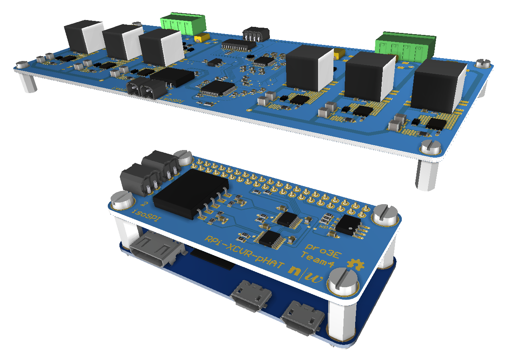
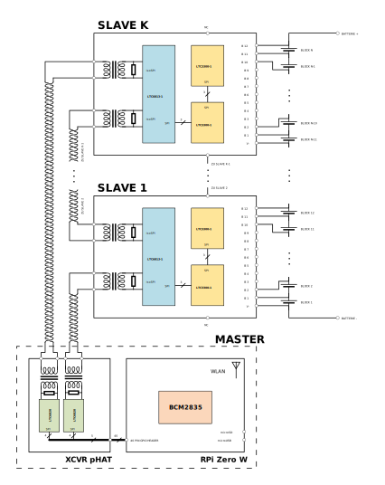

# theBMS
Battery Management System with Active Cell Balancing

## Abstract

Today, many rechargeable lithium-ion cells are thrown away although they are still partially functional and can be reused in other applications. One such application is a home battery system capable of supplying an entire home with electricity. Used batteries have different capacities. For this reason, a special and efficient charging circuit is required. Such a system is the goal of this project. This presented solution includes various safety features, is easy to use and affordable at the same time. Especially since overcharged lithium-ion cells are dangerous and can burst into flames. A prototype was created to test the circuit design of the system. Hardware components from linear technologies were used because they provided two chips for battery management. The system monitors six blocks connected in series. Each block consists of 36 cells connected in parallel. Furthermore, efficient active cell balancing has been implemented to store the energy generated. To guarantee safety and reliability, a temperature sensor has been placed close to the whole battery pack. This allows the system to be shut down if the ambient temperature rises above 45 °C, thus reducing any fire hazard. The electronic circuit is designed modularly so that subsequent changes can be easily incorporated. This also allows the voltage to be as high as 504 volts. A master/slave model is used to implement the overall system. A Raspberry Pi Zero W combined with an extension board for the communication acts as the master unit. The slave units are daisy-chained and are connected to the master unit by a twisted-pair cable. They measure the cell voltages, monitor the temperatures and are responsible for the active balancing. Theoretical calculations are verified by measurements in the laboratory with calibrated measuring tools. These tests show that an efficiency of approximately 81 % is reached. The temperature range is set by the cells and is between 0 °C and 50 °C.

## Block Diagram

## Features

Features include but are not limited to:

* Active cell balancing
* Balancing currents of up to 1.8 A
* Balancing efficiency of up to 87 %
* Reversible isoSPI communication
* Over and under voltage protection
* Temperature monitoring and measurement
* Easy to modify python software
* Web app as a proof of concept

## Product Breakdown Structure (PBS)

* **BMS-000-000**: BMS

  * **BMS-100-000**: Master

    * **BMS-110-000**: Raspberry Pi Zero W
    * **BMS-120-000**: [BMS-Software](https://github.com/MuellerDominik/BMS-Software "BMS-Software")
    * **BMS-130-000**: [RPi-XCVR-pHAT](https://github.com/MuellerDominik/RPi-XCVR-pHAT "RPi-XCVR-pHAT")

  * **BMS-200-000**: Connection (Communication)

  * **BMS-300-000**: [BMS-Board](https://github.com/MuellerDominik/BMS-Board "BMS-Board")

## Downloads

* [Fachbericht](docs/18HS-pro3E-Team4_Fachbericht.pdf "18HS-pro3E-Team4_Fachbericht") (German)
* [Prüfanweisung](docs/18HS-pro3E-Team4_Pruefanweisung.pdf "18HS-pro3E-Team4_Pruefanweisung") (German)
* [Prüfprotokoll](docs/18HS-pro3E-Team4_Pruefprotokoll.pdf "18HS-pro3E-Team4_Pruefprotokoll") (German)
* [BMS-Board (Beta LAYOUT)](docs/BMS-Board_v1_0_0_Beta_LAYOUT.pdf "BMS-Board_v1_0_0_Beta_LAYOUT") (German)
* [RPi-XCVR-pHAT (Beta LAYOUT)](docs/RPi-XCVR-pHAT_v1_0_0_Beta_LAYOUT.pdf "RPi-XCVR-pHAT_v1_0_0_Beta_LAYOUT") (German)

## Authors

* [Dominik Müller](https://github.com/MuellerDominik "@MuellerDominik"), Project Manager
* [Pascal Fankhauser](https://github.com/PascalFankhauser "@PascalFankhauser")
* [Nico Canzani](https://github.com/nicoca20 "@nicoca20")
* [Fabian Frey](https://github.com/freyfabian "@freyfabian")
* [Silvan Koch](https://github.com/sertukla "@sertukla")

## License

Copyright &copy; 2018 pro3E - Team4

This project is licensed under the MIT License - see the [LICENSE](LICENSE "LICENSE") file for details
